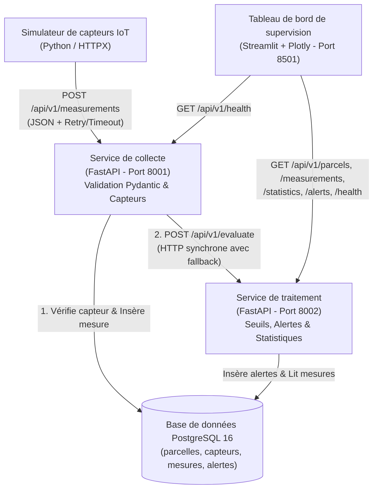
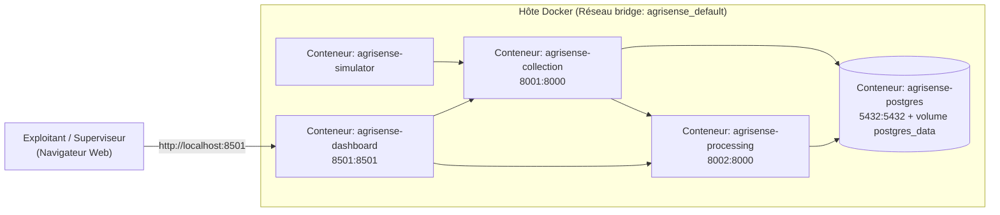

# Architecture Technique AgriSense

## 1. Diagramme d'architecture logique

```mermaid
flowchart TD
    SIM["Simulateur de capteurs IoT<br/>(Python / HTTPX)"]
    COL["Service de collecte<br/>(FastAPI - Port 8001)<br/>Validation Pydantic & Capteurs"]
    PROC["Service de traitement<br/>(FastAPI - Port 8002)<br/>Seuils, Alertes & Statistiques"]
    DB[("Base de données PostgreSQL 16<br/>(parcelles, capteurs, mesures, alertes)")]
    DASH["Tableau de bord de supervision<br/>(Streamlit + Plotly - Port 8501)"]

    SIM -->|"POST /api/v1/measurements<br/>(JSON + Retry/Timeout)"| COL
    COL -->|"1. Vérifie capteur & Insère mesure"| DB
    COL -->|"2. POST /api/v1/evaluate<br/>(HTTP synchrone avec fallback)"| PROC
    PROC -->|"Insère alertes & Lit mesures"| DB
    DASH -->|"GET /api/v1/parcels, /measurements,<br/>/statistics, /alerts, /health"| PROC
    DASH -->|"GET /api/v1/health"| COL
```

## 2. Diagramme de déploiement (Docker Compose)

```mermaid
flowchart LR
    subgraph DockerHost["Hôte Docker (Réseau bridge: agrisense_default)"]
        C_SIM["Conteneur: agrisense-simulator"]
        C_COL["Conteneur: agrisense-collection<br/>8001:8000"]
        C_PROC["Conteneur: agrisense-processing<br/>8002:8000"]
        C_DASH["Conteneur: agrisense-dashboard<br/>8501:8501"]
        C_PG[("Conteneur: agrisense-postgres<br/>5432:5432 + volume postgres_data")]

        C_SIM --> C_COL
        C_COL --> C_PG
        C_COL --> C_PROC
        C_PROC --> C_PG
        C_DASH --> C_PROC
        C_DASH --> C_COL
    end

    USER["Exploitant / Superviseur<br/>(Navigateur Web)"] -->|"http://localhost:8501"| C_DASH
```

